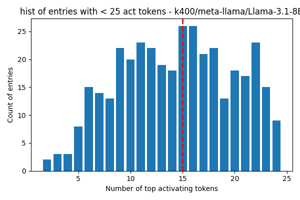
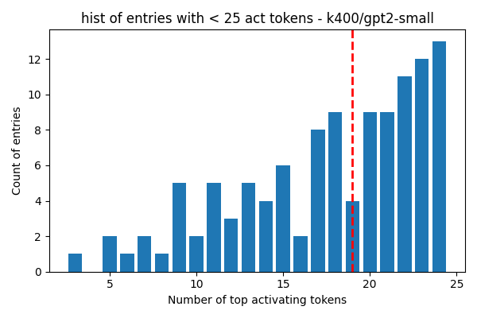
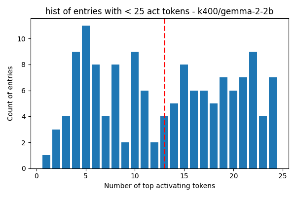
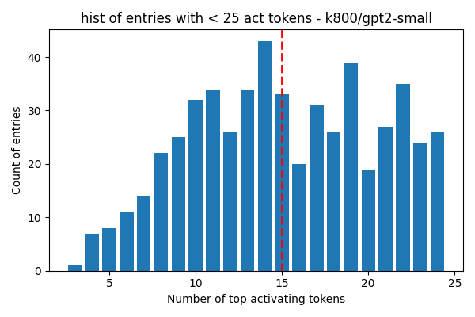
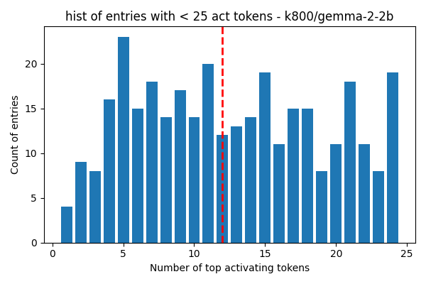

## k400/meta-llama/Llama-3.1-8B

Number of entries with less than 25 activating tokens: 372  
total number of entries in concept_contexts: 5250  
Percentage of entries with less than 25 activating tokens: 7.09%  
Here is the histogram of top activating tokens count for entries with less than 25 activating tokens:  
  

Per layer info:  
Layer 0: 230 entries with less than 25 activating tokens, expected 750, percentage: 30.67%  
Layer 1: 49 entries with less than 25 activating tokens, expected 750, percentage: 6.53%  
Layer 2: 47 entries with less than 25 activating tokens, expected 750, percentage: 6.27%  
Layer 3: 4 entries with less than 25 activating tokens, expected 750, percentage: 0.53%  
Layer 4: 9 entries with less than 25 activating tokens, expected 750, percentage: 1.20%  
Layer 8: 3 entries with less than 25 activating tokens, expected 750, percentage: 0.40%  
Layer 16: 30 entries with less than 25 activating tokens, expected 750, percentage: 4.00%  

## k400/gpt2-small

Number of entries with less than 25 activating tokens: 114  
total number of entries in concept_contexts: 3750  
Percentage of entries with less than 25 activating tokens: 3.04%  
Here is the histogram of top activating tokens count for entries with less than 25 activating tokens:  
  

Per layer info:  
Layer 0: 37 entries with less than 25 activating tokens, expected 750, percentage: 4.93%  
Layer 1: 33 entries with less than 25 activating tokens, expected 750, percentage: 4.40%  
Layer 2: 22 entries with less than 25 activating tokens, expected 750, percentage: 2.93%  
Layer 3: 17 entries with less than 25 activating tokens, expected 750, percentage: 2.27%  
Layer 6: 5 entries with less than 25 activating tokens, expected 750, percentage: 0.67%  

## k400/gemma-2-2b

Number of entries with less than 25 activating tokens: 141  
total number of entries in concept_contexts: 4500  
Percentage of entries with less than 25 activating tokens: 3.13%  
Here is the histogram of top activating tokens count for entries with less than 25 activating tokens:  
  

Per layer info:  
Layer 0: 73 entries with less than 25 activating tokens, expected 750, percentage: 9.73%  
Layer 1: 7 entries with less than 25 activating tokens, expected 750, percentage: 0.93%  
Layer 2: 23 entries with less than 25 activating tokens, expected 750, percentage: 3.07%  
Layer 3: 34 entries with less than 25 activating tokens, expected 750, percentage: 4.53%  
Layer 6: 4 entries with less than 25 activating tokens, expected 750, percentage: 0.53%  

## k800/gpt2-small

Number of entries with less than 25 activating tokens: 537  
total number of entries in concept_contexts: 7750  
Percentage of entries with less than 25 activating tokens: 6.93%  
Here is the histogram of top activating tokens count for entries with less than 25 activating tokens:  
  

Per layer info:  
Layer 0: 285 entries with less than 25 activating tokens, expected 1550, percentage: 18.39%  
Layer 1: 123 entries with less than 25 activating tokens, expected 1550, percentage: 7.94%  
Layer 2: 62 entries with less than 25 activating tokens, expected 1550, percentage: 4.00%  
Layer 3: 37 entries with less than 25 activating tokens, expected 1550, percentage: 2.39%  
Layer 6: 30 entries with less than 25 activating tokens, expected 1550, percentage: 1.94%  

## k800/gemma-2-2b

Number of entries with less than 25 activating tokens: 332  
total number of entries in concept_contexts: 9300  
Percentage of entries with less than 25 activating tokens: 3.57%  
Here is the histogram of top activating tokens count for entries with less than 25 activating tokens:  
  

Per layer info:  
Layer 0: 123 entries with less than 25 activating tokens, expected 1550, percentage: 7.94%  
Layer 1: 31 entries with less than 25 activating tokens, expected 1550, percentage: 2.00%  
Layer 2: 59 entries with less than 25 activating tokens, expected 1550, percentage: 3.81%  
Layer 3: 85 entries with less than 25 activating tokens, expected 1550, percentage: 5.48%  
Layer 6: 30 entries with less than 25 activating tokens, expected 1550, percentage: 1.94%  
Layer 12: 4 entries with less than 25 activating tokens, expected 1550, percentage: 0.26%  

