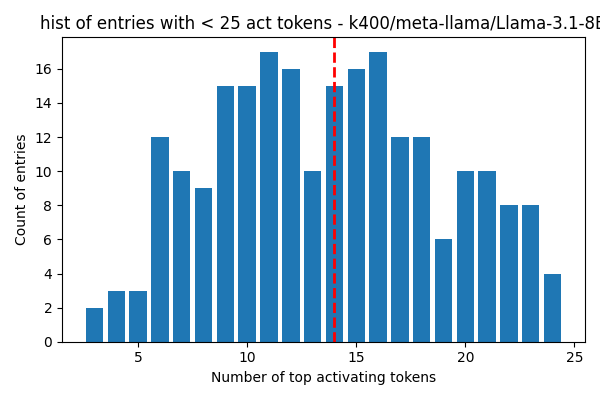

## k400/meta-llama/Llama-3.1-8B - layer 0

Number of entries with less than 25 activating tokens: 230  
total number of entries in concept_contexts: 750  
Percentage of entries with less than 25 activating tokens: 30.67%  
Here is the histogram of top activating tokens count for entries with less than 25 activating tokens:  
  

